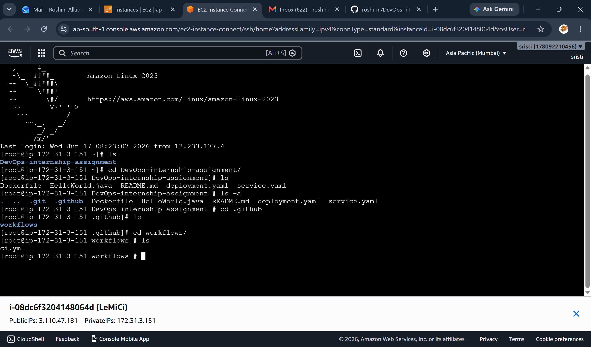
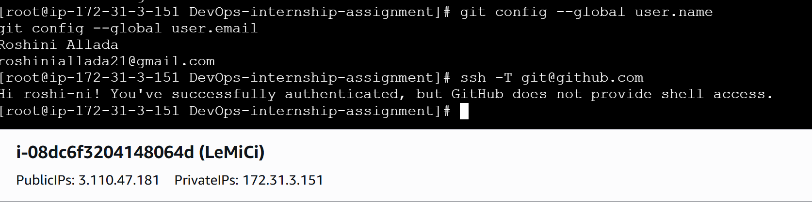
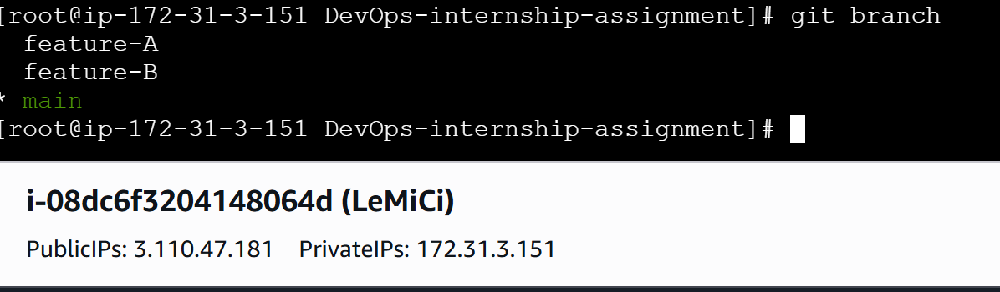
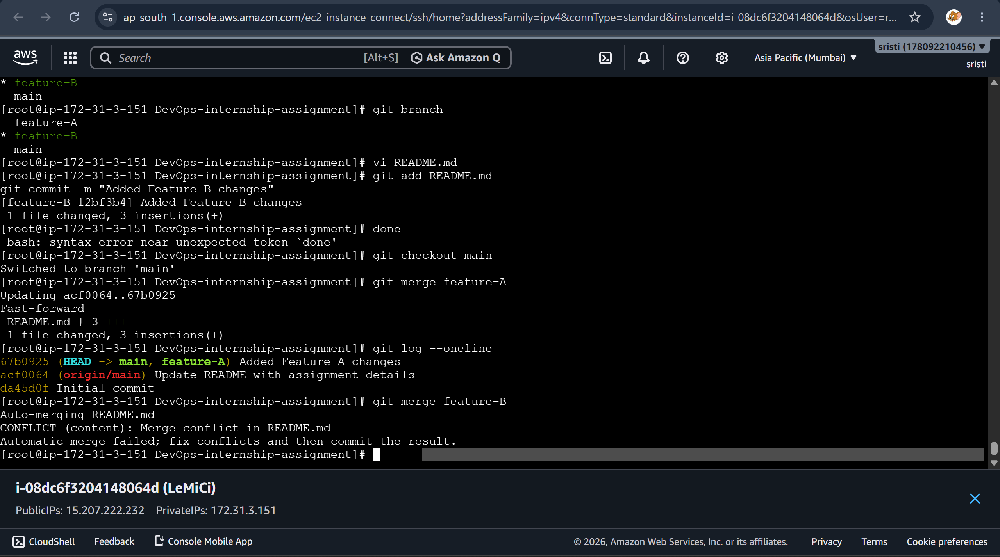
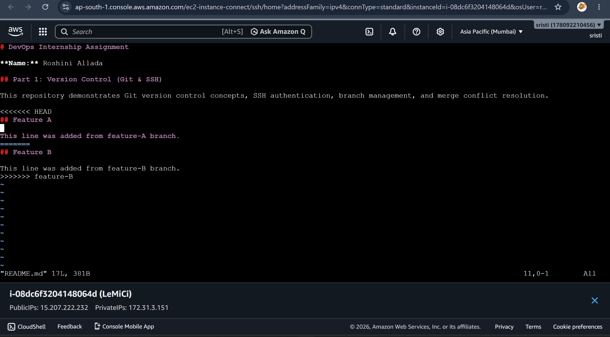
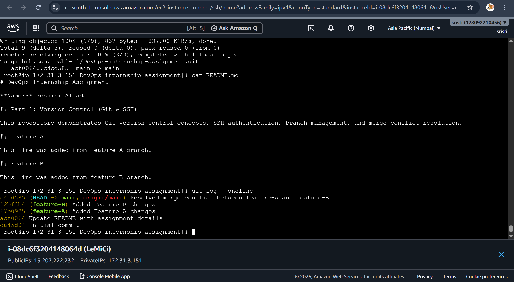
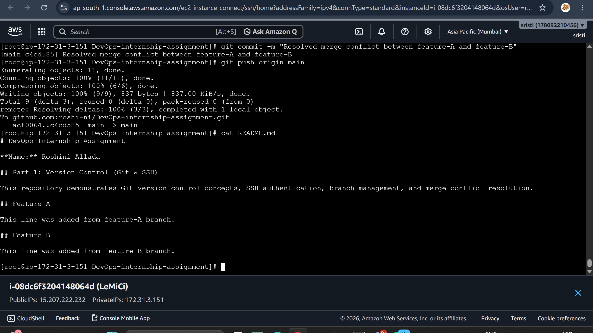
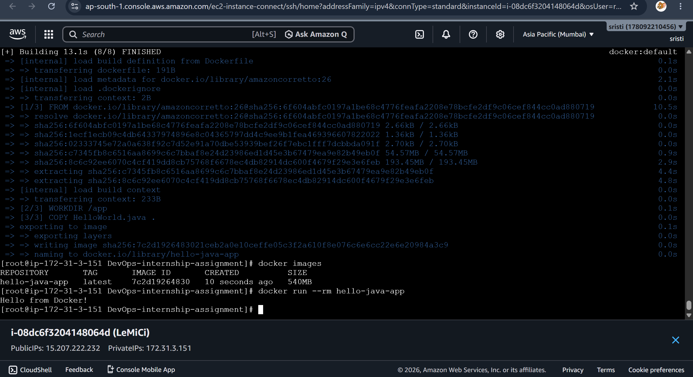
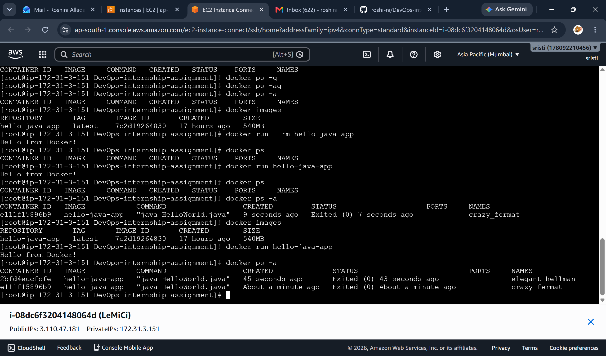
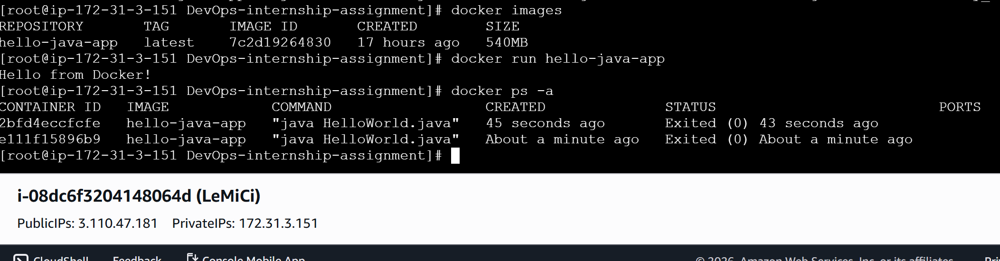

# DevOps Internship Assignment

**Name:** Roshini Allada

## Contents

- Part 1: Git & SSH
- Part 2: Docker & Containerization
- Part 3: Kubernetes (EKS Basics)
- Part 4: CI/CD Pipeline
- Part 5: Monitoring & Logs
- Part 6: Problem-Solving Scenario

## Files Included

- README.md
- HelloWorld.java
- Dockerfile
- deployment.yaml
- service.yaml
- .github/workflows/ci.yml
  
## Repository Structure




## Part 1: Version Control (Git & SSH)

This repository demonstrates Git version control concepts, SSH authentication, branch management, and merge conflict resolution.

## SSH Authentication

 


### Difference between git fetch and git pull

## git fetch

Downloads the latest changes from the remote repository but does not merge them into the current branch.

Example:
git fetch origin

## git pull

Downloads the latest changes and automatically merges them into the current branch.

Example:
git pull origin main

## Summary
git fetch = download only
git pull = download + merge

## Merge Conflict Resolution

I created two branches:

- feature-A
- feature-B

## Branch Creation




Both branches modified the same section of README.md.

### Steps followed:

- Created feature-A branch and added changes.
- Created feature-B branch and added changes.
- Merged feature-A into main successfully.
- Attempted to merge feature-B into main.
- Git reported a merge conflict.
- Opened README.md and reviewed conflict markers.
- Kept the required content from both branches.
- Removed conflict markers.
- Added the file using git add README.md.
- Completed the merge using git commit.

This successfully resolved the merge conflict.

## Feature A

This line was added from feature-A branch.

## Feature B

This line was added from feature-B branch.

## Merge Conflict









 
## Part 2: Docker & Containerization

## Dockerfile

A Dockerfile is a text file that contains instructions to build a Docker image. It defines the base image, dependencies, files to copy, and commands to execute.

Example:
```dockerfile
FROM amazoncorretto:26
WORKDIR /app
COPY HelloWorld.java .
CMD ["java", "HelloWorld.java"]
```

## Docker Image

A Docker image is a packaged template created from a Dockerfile. It contains the application code, dependencies, and runtime environment.

Example:
hello-java-app:latest

## Docker Container

A Docker container is a running instance of a Docker image. It executes the application in an isolated environment.

Example:
docker run hello-java-app

## Docker Build and Run

### Docker Execution Result

Command:

docker run --rm hello-java-app

Output:

Hello from Docker!









## Reducing Docker Image Size

If the Docker image is too large, I would:

- Use a smaller base image.
- Use multi-stage builds.
- Remove unnecessary packages and files.
- Combine RUN commands to reduce layers.
- Use a .dockerignore file to exclude unwanted files.
- Copy only required files into the image.

## Part 3: Kubernetes (EKS Basics)

### Difference between Pod, Deployment, and Service

### Pod
A Pod is the smallest deployable unit in Kubernetes. It contains one or more containers that share the same network and storage.

Example:
- A Java application running inside a single container.

### Deployment
A Deployment manages Pods. It ensures that the required number of replicas are running and supports rolling updates and rollbacks.

Example:
- Running 2 replicas of the HelloWorld application.

### Service
A Service provides a stable network endpoint to access Pods. It also distributes traffic among multiple Pods.

Example:
- A LoadBalancer Service exposes the application externally.

### Why use Amazon EKS?

Amazon EKS is a managed Kubernetes service provided by AWS.

Advantages:
- AWS manages the Kubernetes control plane.
- Automatic updates and patching.
- High availability.
- Better security integration with IAM.
- Easy integration with AWS services.
- Reduced operational overhead.
- Easier cluster management compared to self-managed Kubernetes on VMs.

## Part 4: CI/CD Pipeline

The GitHub Actions workflow performs the following:

1. Checks out the source code.
2. Builds the Docker image.
3. Runs a simple test.
4. Simulates pushing the Docker image to DockerHub.

### Deploying to Kubernetes

If deployment to Kubernetes is required, an additional stage can be added after the Docker image is built and pushed.

Flow:

GitHub
↓
GitHub Actions
↓
Build Docker Image
↓
Push to DockerHub/ECR
↓
Deploy to Kubernetes (kubectl apply or Helm)
↓
Application Available in EKS


## Part 5: Monitoring & Logs

### Metrics

Metrics are numerical values collected over time to measure system performance.

Examples:
- CPU Usage
- Memory Usage
- Disk Usage
- Request Count

Metrics help monitor the health and performance of applications.

### Logs

Logs are detailed records of events generated by applications and systems.

Examples:
- Error messages
- Application startup logs
- User login events

Logs help identify and troubleshoot issues.

### Traces

Traces track the complete path of a request as it travels through multiple services.

They help identify latency and bottlenecks in distributed applications.

### Debugging a Crashed Kubernetes Pod

Step 1:
```bash
kubectl get pods
```

Check the pod status.

Step 2:
```bash
kubectl describe pod <pod-name>
```

View events and identify scheduling or configuration issues.

Step 3:
```bash
kubectl logs <pod-name>
```

View application logs.

Step 4:
```bash
kubectl logs <pod-name> --previous
```

View logs from the previous crashed container.

Step 5:
```bash
kubectl exec -it <pod-name> -- /bin/sh
```

Access the container for debugging (if it is running).

Step 6:
Check:
- Image name
- Environment variables
- Resource limits
- ConfigMaps
- Secrets
- Network connectivity


### Monitoring Tools for AWS EKS

**Prometheus**
- Collects metrics from Kubernetes workloads.

**Grafana**
- Visualizes metrics using dashboards.

**Amazon CloudWatch**
- Stores logs and metrics.
- Integrates well with AWS services.

**ELK Stack (Elasticsearch, Logstash, Kibana)**
- Centralized log collection and analysis.

A common production setup is:
- Prometheus for metrics
- Grafana for visualization
- CloudWatch or ELK for logs


## Part 6: Problem-Solving Scenario

### Approach

1. Clone the source code from GitHub.

2. Containerize the application using Docker.

3. Build and test the Docker image.

4. Push the image to DockerHub or Amazon ECR.

5. Create Kubernetes Deployment and Service manifests.

6. Configure GitHub Actions or Jenkins to:
   - Build the application
   - Run tests
   - Build Docker image
   - Push Docker image
   - Deploy to Amazon EKS

7. Configure logging using CloudWatch or ELK.

8. Configure monitoring using Prometheus and Grafana.

9. Verify deployment and monitor application health.
